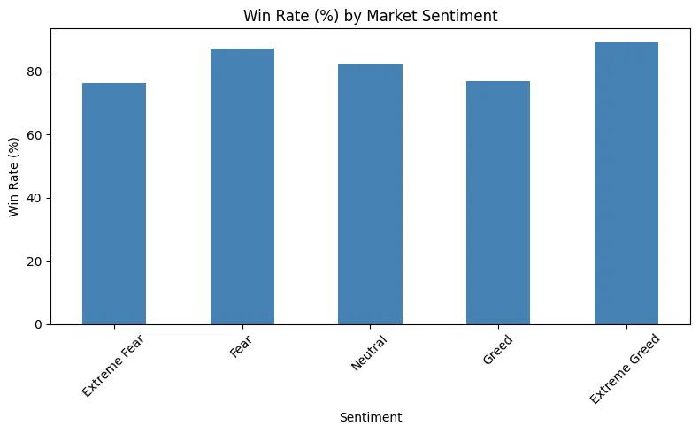
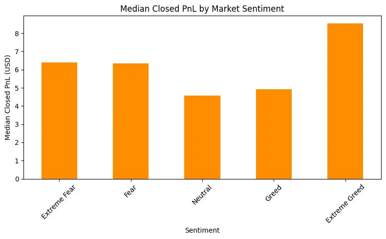
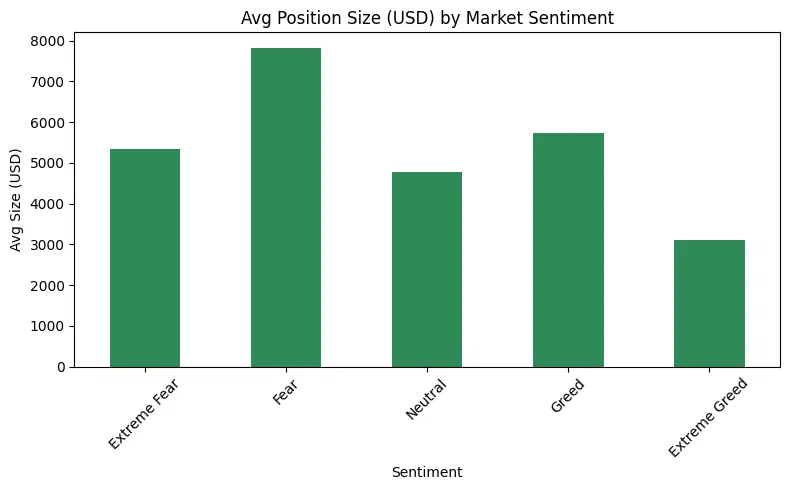

# Bitcoin Trader Performance vs Market Sentiment

Analysis of how trader behavior and performance on Hyperliquid relate to Bitcoin market sentiment (Fear/Greed Index).

## TL;DR
Traders perform best (highest win rate, highest profit) during Extreme Greed — even though they bet the *least* money in that mood. During Fear, they bet the *most* money despite it not being their best-performing regime. This isn't random: the same traders show this pattern consistently across market moods, meaning sentiment genuinely changes how people trade, not just who's trading.

## Data Sources

- **[Trader Data](https://drive.google.com/file/d/1IAfLZwu6rJzyWKgBToqwSmmVYU6VbjVs/view)**: Historical trade-level data from Hyperliquid (account, execution price, size, side, closed PnL, timestamps).
- **[Fear/Greed Index](https://drive.google.com/file/d/1PgQC0tO8XN-wqkNyghWc_-mnrYv_nhSf/view)**: Bitcoin Fear/Greed Index (daily classification: Extreme Fear → Extreme Greed).

## Data Quality Notes
- The trader dataset's `Timestamp` column (unix epoch, ms) was found to be corrupted — only 7 unique values across 211,224 rows. Discarded in favor of the `Timestamp IST` string column, which was parsed and validated instead.
- 6 rows (0.003%) had no matching sentiment date after the merge and were dropped.
- Only **32 unique trading accounts** are present in the dataset. Findings reflect the behavior of a small, likely sophisticated/algorithmic trader base — not a representative retail sample. Generalize with caution.

## Methodology
1. Parsed and validated timestamps from `Timestamp IST`.
2. Merged trader data with daily sentiment on date.
3. Computed win rate, PnL, and position size grouped by sentiment (closed trades only, `Closed PnL != 0`).
4. Checked directional bias (Buy/Sell) by sentiment.
5. Checked whether sentiment effects reflect genuine behavior change (same accounts across regimes) vs. a population artifact (different accounts per regime).

## Key Findings

**1. Win rate and PnL both peak in Extreme Greed, not Fear.**
| Sentiment | Win Rate | Median PnL | Avg Position Size |
|---|---|---|---|
| Extreme Fear | 76% | $6.4 | $5,350 |
| Fear | 87% | $6.3 | $7,816 |
| Neutral | 82% | $4.6 | $4,783 |
| Greed | 77% | $4.9 | $5,737 |
| Extreme Greed | 89% | $8.6 | $3,112 |

Note: win rates here are unusually high relative to typical trading data (40-55% is more common even for profitable traders) - likely a function of the small, non-representative account sample rather than a universal pattern.

**2. Fear regimes see the largest position sizes, despite not having the best performance.** Traders size up the most during Fear ($7,816 avg) but Extreme Greed, with the smallest average size ($3,112), has better win rate and PnL. Sizing behavior doesn't track with where performance is actually best.

**3. No directional bias by sentiment.** Buy/Sell split stays within 45-55% across all regimes, sentiment does not meaningfully predict whether traders go long or short.

**4. The sentiment effect is behavioral, not a population artifact.** 75% of accounts (24 of 32) traded across all 5 sentiment regimes. The same accounts show an average 42.6-point win-rate swing between their best and worst sentiment regime (max: 100 points). This means individual traders genuinely perform differently depending on market mood, it's not just different trader cohorts showing up in different regimes.

**5. PnL is heavily right-skewed.** Mean PnL is consistently much higher than median across all sentiment groups (e.g. Extreme Greed: mean $130 vs median $8.6), a small number of large wins pull the average up. Median is the more honest "typical trade" figure.

## Charts





## How to Run
```bash
pip install -r requirements.txt
jupyter notebook analysis.ipynb
```

## Limitations
- Small account sample (n=32) - findings are descriptive, not statistically generalizable.
- Correlation only; no causal claims about sentiment driving performance.